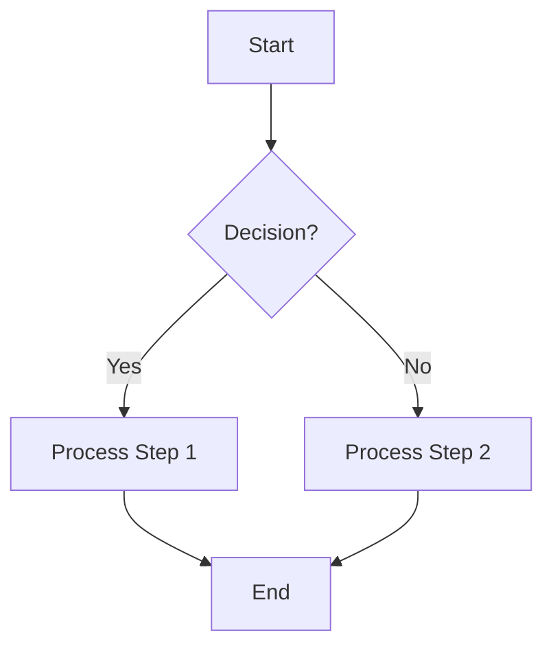

**Title:** Choosing the Right Tool for Creating Realistic Images: Mermaid vs. TikZ

**Description:**  
Before using any model to create realistic images, consider these two powerful tools for generating structured, high-quality figures. Mermaid and TikZ offer different approaches—one focusing on simplicity and markdown-based diagrams, the other on precise LaTeX-generated illustrations. This post explores best practices, examples, and storytelling to help you make the best choice for your needs.

---

### Introduction: The Challenge of Creating Realistic Images

Imagine you're working on a technical document, research paper, or a presentation. You need to include high-quality visuals, but standard drawing tools feel cumbersome, and AI-generated images may not meet your needs. This is where text-based image generation tools like Mermaid and TikZ come in.

Both tools allow you to create figures programmatically, but they have distinct advantages and ideal use cases. Let’s dive into each and explore best practices for using them effectively.

---

### **Mermaid: A Markdown-Based Diagramming Tool**

Mermaid is a graphical web library that enables users to generate diagrams using plain text (Markdown). It’s widely used for flowcharts, sequence diagrams, Gantt charts, and more. If you need quick, structured visuals that integrate seamlessly with documentation platforms like GitHub, Notion, or Obsidian, Mermaid is an excellent choice.

#### **Best Practices for Using Mermaid**

- **Keep it Simple:** Mermaid works best for structured diagrams. Avoid overly complex visuals.
- **Use Proper Indentation:** Mermaid scripts rely on proper indentation for clarity and functionality.
- **Leverage Documentation:** The official Mermaid documentation is comprehensive—refer to it for advanced features.
- **Integrate with Markdown Platforms:** If your workflow includes tools like Notion, GitHub, or MkDocs, Mermaid fits naturally.

#### **Example: Creating a Flowchart with Mermaid**



---

### **TikZ: A LaTeX-Based Drawing Package**

TikZ is a powerful LaTeX package that allows users to create any type of figure directly within LaTeX. It’s ideal for precise, mathematical, and publication-quality diagrams.

#### **Best Practices for Using TikZ**

- **Use Predefined Styles:** Define reusable styles to keep your diagrams clean and consistent.
- **Combine with LaTeX Features:** Integrate with mathematical expressions and labels for seamless document formatting.
- **Optimize Code for Readability:** Break long lines and use comments for clarity.
- **Utilize Online Tools:** Platforms like Overleaf can simplify TikZ development with real-time previews.

#### **Example: Drawing a Simple Graph with TikZ**

```latex
\documentclass{article}
\usepackage{tikz}
\begin{document}
\begin{tikzpicture}
    \draw[thick] (0,0) -- (2,2);
    \draw[thick] (2,2) -- (4,0);
    \draw[thick] (4,0) -- (0,0);
    \filldraw[red] (2,2) circle (3pt);
\end{tikzpicture}
\end{document}
```

---

### **Storytelling: Choosing the Right Tool for the Right Job**

Meet Alex, a software engineer documenting a complex workflow. He needs a simple, quick way to visualize data flow and dependencies. Alex chooses Mermaid because of its seamless integration with Markdown-based documentation.

Meanwhile, Dr. Elena, a researcher in theoretical physics, is preparing a paper for publication. She needs precise, mathematical illustrations and opts for TikZ to ensure her figures maintain high-quality typesetting within LaTeX.

Their different choices highlight a key takeaway: **Mermaid is great for quick, structured diagrams, while TikZ excels in precision and complexity.**

---

### **Conclusion: Which One Should You Use?**

- **Use Mermaid** if you need quick, structured diagrams in a Markdown-based environment.
- **Use TikZ** if you need precise, mathematical, or highly detailed figures within LaTeX documents.

Understanding the strengths of each tool ensures you choose the right one for your project. Whether you're documenting workflows or creating scientific illustrations, Mermaid and TikZ are both invaluable resources for generating realistic, structured images.