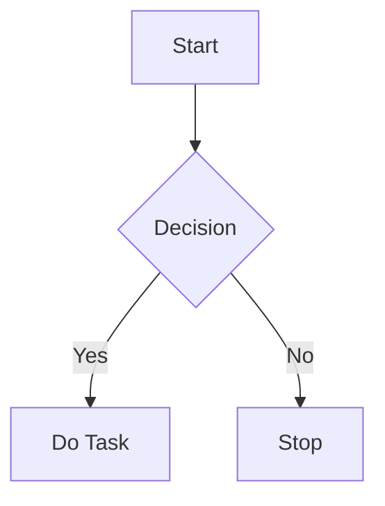

## 1. Headings
Use `#` for headings. Add more `#` for smaller headings.

```markdown
# Heading 1
## Heading 2
### Heading 3
#### Heading 4


# Heading 1  
## Heading 2  
### Heading 3  
#### Heading 4  

---

## 2. Emphasis
- **Bold**: Use `**` or `__`.
- *Italic*: Use `*` or `_`.
- ***Bold and Italic***: Combine `***` or `___`.

```markdown
**Bold**  
*Italic*  
***Bold and Italic***  
```

**Bold**  
*Italic*  
***Bold and Italic***

---

## 3. Lists
### Unordered Lists
Use `-`, `*`, or `+` for bullet points.

```markdown
- Item 1
- Item 2
  - Subitem 1
  - Subitem 2
```

- Item 1  
- Item 2  
  - Subitem 1  
  - Subitem 2  

### Ordered Lists
Use numbers followed by a period.

```markdown
1. First
2. Second
   1. Nested First
   2. Nested Second
```

1. First  
2. Second  
   1. Nested First  
   2. Nested Second  

---

## 4. Links
Syntax: `[Link Text](URL)`

```markdown
[Visit Google](https://www.google.com)
```

[Visit Google](https://www.google.com)

---

## 5. Images
Syntax: ``

```markdown

```


---

## 6. Code
### Inline Code
Use backticks (\`).

```markdown
This is `inline code`.
```

This is `inline code`.

### Code Blocks
Use triple backticks (\`\`\`).

```markdown
```
def hello_world():
    print("Hello, World!")
```
```

```python
def hello_world():
    print("Hello, World!")
```

---

## 7. Blockquotes
Use `>` for blockquotes.

```markdown
> This is a blockquote.
>> Nested blockquote.
```

> This is a blockquote.  
>> Nested blockquote.

---

## 8. Horizontal Lines
Use `---` or `***`.

```markdown
---
***
```

---
***

---

## 9. Tables
Use `|` and `-` for tables.

```markdown
| Header 1 | Header 2 |
|----------|----------|
| Row 1    | Data 1   |
| Row 2    | Data 2   |
```

| Header 1 | Header 2 |
|----------|----------|
| Row 1    | Data 1   |
| Row 2    | Data 2   |

---

## 10. Task Lists
Use `- [ ]` for an empty box and `- [x]` for a checked box.

```markdown
- [x] Completed Task
- [ ] Incomplete Task
```

- [x] Completed Task  
- [ ] Incomplete Task  

---

## 11. Escape Characters
Use a backslash `\` to escape Markdown characters.

```markdown
\*Not italicized\*  
\# Not a heading
```

\*Not italicized\*  
\# Not a heading  

---

## 12. Equations
Use `$` for inline math and `$$` for block math.


Inline: $E = mc^2$

Block:
$$
\int_{a}^{b} x^2 \, dx = \frac{b^3}{3} - \frac{a^3}{3}
$$


### Inline

$E = mc^2$

### Block
$$
\int_{a}^{b} x^2 \, dx = \frac{b^3}{3} - \frac{a^3}{3}
$$

---

## 13. Mermaid Diagrams
Use `mermaid` to create diagrams.





---

That's a complete demonstration of Markdown features, including equations and diagrams! 🎉
```

This unified Markdown file is ready to be rendered with tools like [reveal-md](https://github.com/webpro/reveal-md), [Marp](https://marp.app/), or any Markdown editor that supports MathJax for equations and Mermaid for diagrams.